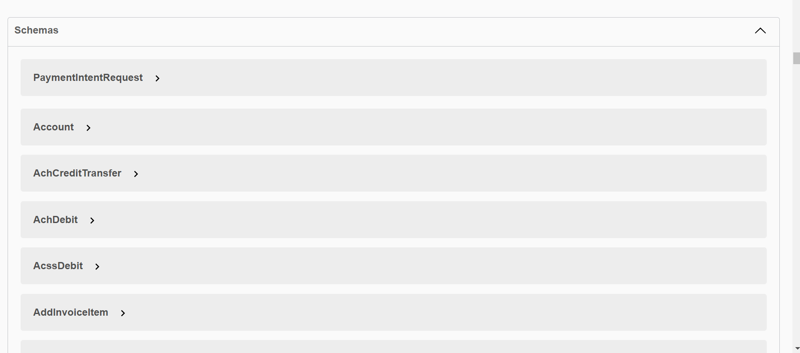

## Portone Assignment


## Stripe Payment Gateway Integration

 **REST API SERVICE**

The **Portone Assignment** is a REST API and it is integrate the Stripe Payment Gateway which allows to perform the **Create Payment Intent**, **Capture the Created Payment Intent**, **Create the Refund** and **Get All Payment Intent**.

The **Portone Assignment** REST API simplified Exception Handling for layman's easy understanding. 

The API's primary objective is to provide to the customer **with a seamless experience and user-friendly environment during online payment.**

The API's Services consist the following points with HTTP Methods:
|S.No. | End Point | HTTP Method |
|:-----:|:-------|:----------:|
| 1 | ```/api/v1/create_intent``` | POST |
| 2 | ```/api/v1/attach_payment_metho``` | POST |
| 3 | ```/api/v1/capture_intent/{id}``` | POST |
| 4 | ```/api/v1/create_refund/{id}``` | POST |
| 5 | ```/api/v1/get_intents``` | GET |

## Tech Stack

- JAVA
- SPRING
- SPRINGBOOT
- MAVEN
- SWAGGER UI

## Dependencies

- SPRING BOOT DEVTOOLS
- SPRING WEB
- LOMBOK
- SWAGGER UI
  
## Modules

- Payment Intent Module
- Capture Module
- Refund Module
- Exception Handler Module

## System Structure

The REST API allows a Customer to **Create Payment**, **Capture Payment** **Refund Payment** & **Get All Payment Information** through the **browser** with appropriate Http Methods.

## About
This assignment is for **portone.io**, This is an online accept the payment (payment gateway) Rest API. We built this Rest API assignment Within 2 days and Please [click here for Demo Video](https://drive.google.com/file/d/1h5YWO9Tjh-r-Aey1Fn6W5U5pkTKz143j/view?usp=sharing).

## Feature
- Create Payment
- Capture Payment
- Refund Payment
- Get All Payment Information

## Installation And Run Project

- copy this https://github.com/sunnylalwani41/Portone_Assignment.git
- Select path where you want to store the project in your pc
- open the corresponding file / folder with editor
- open terminal of your editor
- use command --> git clone (paste link) <-- 
- after project cloned to your folder
- go to StripePaymentGatewayIntegrationApplication.java file inside io.portone folder/package
- Before the run this project, ensure LOMBOK should be proper installed in the IDE.
- run as Spring Boot
- This application run on the port 4050
- After the run project [click here](http://localhost:4050/swagger-ui/index.html) to view the project in swagger-ui

### Postman link of Stripe Payment Gateway Integration
click here to see in the [Postman](https://www.postman.com/material-geologist-27820143/workspace/stripe-payment-gateway).

### Deploy Link
[Click here](http://34.0.8.234:4020/swagger-ui/index.html)

## Screenshot

### Swagger UI Page


### Payment Intent Parameter


### Response Body


### Schemas

